# @sdd-drift Flow Diagram

```mermaid
flowchart TD
    Start([User: @sdd-drift]) --> CheckConstitution{Constitution exists?<br/>.specify/memory/<br/>constitution.md}

    CheckConstitution -->|No| ErrorNoConst[ERROR: Constitution not found<br/>Run @sdd-init first<br/>STOP]
    CheckConstitution -->|Yes| LoadConstitution[Load constitution.md<br/>All principles & requirements]

    LoadConstitution --> LoadTemplate[Load drift-template.md]

    LoadTemplate --> ScanProject[Scan project structure:<br/>- README.md, package.json<br/>- Documentation<br/>- Code structure<br/>- Testing setup<br/>- CI/CD config<br/>- Dependencies]

    ScanProject --> CheckSecurity[Check security drift:<br/>- Exposed secrets<br/>- Vulnerable dependencies<br/>- Insecure configurations<br/>- Missing auth/authz<br/>- Security logging]

    CheckSecurity --> CheckStandards[Check coding standards:<br/>- Linting rules<br/>- Formatting consistency<br/>- Naming conventions<br/>- Code complexity<br/>- Documentation]

    CheckStandards --> CheckArchitecture[Check architecture drift:<br/>- Design patterns<br/>- Module structure<br/>- Separation of concerns<br/>- API contracts<br/>- Error handling]

    CheckArchitecture --> CheckTesting[Check testing drift:<br/>- Test coverage<br/>- Test organization<br/>- Integration tests<br/>- Contract tests<br/>- E2E tests]

    CheckTesting --> CheckOps[Check operations drift:<br/>- CI/CD pipeline<br/>- Deployment practices<br/>- Monitoring setup<br/>- Logging standards<br/>- Configuration management]

    CheckOps --> CompareAll[Compare each principle<br/>against project state]

    CompareAll --> IdentifyGaps[Identify drift items:<br/>- Missing files<br/>- Configuration gaps<br/>- Practice violations<br/>- Quality issues]

    IdentifyGaps --> PrioritizeItems{Prioritize by severity}

    PrioritizeItems --> Critical[CRITICAL:<br/>Security vulnerabilities<br/>Exposed secrets<br/>Unsafe dependencies]
    PrioritizeItems --> High[HIGH:<br/>Missing security controls<br/>Standard violations<br/>Broken builds]
    PrioritizeItems --> Medium[MEDIUM:<br/>Documentation gaps<br/>Incomplete testing<br/>Quality issues]
    PrioritizeItems --> Low[LOW:<br/>Style inconsistencies<br/>Optimization opportunities]

    Critical --> CalcScore
    High --> CalcScore
    Medium --> CalcScore
    Low --> CalcScore

    CalcScore[Calculate drift score:<br/>drift % = violations / total<br/>Include severity weighting]

    CalcScore --> CheckExisting{CONSTITUTION_DRIFT.md<br/>exists?}

    CheckExisting -->|Yes| Overwrite[Overwrite existing file]
    CheckExisting -->|No| CreateNew[Create new file]

    Overwrite --> GenerateReport
    CreateNew --> GenerateReport

    GenerateReport[Generate drift report:<br/>- Header with date & score<br/>- Summary statistics<br/>- Section per principle<br/>- Detailed drift items<br/>- Action plan<br/>- Progress tracking]

    GenerateReport --> SaveReport[Save to:<br/>.specify/specs/<br/>CONSTITUTION_DRIFT.md]

    SaveReport --> ShowSummary[Display summary:<br/>- Total drift items by priority<br/>- Compliance percentage<br/>- Drift score<br/>- Next actions<br/>- Timeline suggestions]

    ShowSummary --> Done([Complete: Drift report created<br/>Review and remediate])

    style Start fill:#e1f5ff
    style Done fill:#d4edda
    style ErrorNoConst fill:#f8d7da
    style CheckConstitution fill:#fff3cd
    style PrioritizeItems fill:#fff3cd
    style CheckExisting fill:#fff3cd
    style Critical fill:#f8d7da
    style High fill:#ffeaa7
    style Medium fill:#fff3cd
    style Low fill:#dfe6e9
```



## Key Decision Points

### 1. **Constitution Existence Check**

**Location**: First step after command invocation  
**Purpose**: Verify project has a constitution to audit against  
**Decision Logic**:

- ✅ Constitution exists → Continue
- ❌ No constitution → Stop with error

**Why Important**: Cannot detect drift without a constitution defining expected standards.

---

### 2. **Severity Prioritization**

**Location**: After identifying all drift items  
**Purpose**: Categorize issues by impact and urgency  
**Decision Logic**:

- **Critical**: Security vulnerabilities, exposed secrets, unsafe dependencies
- **High**: Missing security controls, standard violations, broken builds
- **Medium**: Documentation gaps, incomplete testing, minor quality issues
- **Low**: Style inconsistencies, optimization opportunities

**Why Important**: Helps teams prioritize remediation efforts and allocate resources effectively.

---

### 3. **File Overwrite Check**

**Location**: Before saving drift report  
**Purpose**: Determine if updating existing report or creating new one  
**Decision Logic**:

- If `CONSTITUTION_DRIFT.md` exists → Overwrite with latest findings
- Otherwise → Create new file

**Why Important**: Ensures latest drift status is always available and historical reports don't accumulate.

---

## Drift Scanning Areas

### 1. Security Drift 🔒

**What's Checked**:

- 🔑 Exposed secrets, API keys, passwords in code
- 📦 Vulnerable dependencies (CVEs)
- ⚙️ Insecure configurations (CORS, HTTPS, headers)
- 🚪 Missing authentication/authorization
- 📝 Missing security logging (audit trails)
- 🛡️ Insufficient input validation

**Priority**: Always CRITICAL or HIGH

---

### 2. Coding Standards Drift 📝

**What's Checked**:

- 🎨 Missing or misconfigured linting rules
- 🔤 Inconsistent formatting
- 📛 Naming convention violations
- 🔢 High code complexity (cyclomatic complexity)
- 📚 Missing or outdated documentation
- 🏗️ Architectural pattern violations

**Priority**: Usually HIGH or MEDIUM

---

### 3. Architecture Drift 🏗️

**What's Checked**:

- 🎯 Design pattern inconsistencies
- 📦 Poor module organization
- 🔀 Lack of separation of concerns
- 📡 Broken or missing API contracts
- ⚠️ Inconsistent error handling
- 🔄 Tight coupling between components

**Priority**: Usually MEDIUM or HIGH

---

### 4. Testing Drift ✅

**What's Checked**:

- 📊 Test coverage below threshold
- 🗂️ Disorganized test structure
- 🔌 Missing integration tests
- 📋 Missing contract tests
- 🌐 Missing end-to-end tests
- 🧪 Outdated test data or mocks

**Priority**: Usually MEDIUM or HIGH

---

### 5. Operations Drift ⚙️

**What's Checked**:

- 🚀 Missing or broken CI/CD pipelines
- 🔧 Inconsistent deployment practices
- 📈 Missing monitoring/alerting setup
- 📋 Non-compliant logging standards
- 🌍 Poor environment configuration management
- 📦 Undocumented infrastructure

**Priority**: Usually MEDIUM or HIGH

---

## Drift Score Calculation

### Formula

```
Drift Score = (Total Violations / Total Principles) × 100
```

### Severity Weighting

```
Weighted Score = Σ(Violation_Count × Severity_Weight)

Severity Weights:
- Critical: 4.0
- High: 2.0
- Medium: 1.0
- Low: 0.5
```

### Compliance Percentage

```
Compliance % = 100 - Drift Score
```

### Example Calculation

```
Total Principles: 50
Violations:
- Critical: 2 → 2 × 4.0 = 8.0
- High: 5 → 5 × 2.0 = 10.0
- Medium: 10 → 10 × 1.0 = 10.0
- Low: 8 → 8 × 0.5 = 4.0

Weighted Score = 32.0
Max Possible Score = 50 × 4.0 = 200.0

Drift Score = (32.0 / 200.0) × 100 = 16%
Compliance = 100 - 16 = 84%
```

---

## Drift Report Structure

The generated `CONSTITUTION_DRIFT.md` includes:

### 1. Header Section

```markdown
# Constitution Drift Report

**Generated**: October 11, 2025  
**Constitution Version**: 0.2.0  
**Drift Score**: 16%  
**Compliance**: 84%
```

### 2. Summary Statistics

```markdown
## Summary

- **Total Drift Items**: 25
- **Critical**: 2 🔴
- **High**: 5 🟠
- **Medium**: 10 🟡
- **Low**: 8 🔵

**Top Concern**: Exposed API keys in environment files
```

### 3. Drift Items by Principle

One section per constitutional principle:

```markdown
## Security Principles

### SP-001: Secret Management

**Status**: ❌ Non-Compliant  
**Priority**: CRITICAL  
**Drift Score**: 100%

**Current State**:

- API keys exposed in `.env` file
- AWS credentials in `config/production.js`
- Database password in plain text

**Required State**:

- All secrets in secure vault (AWS Secrets Manager / HashiCorp Vault)
- No plaintext credentials in code or config
- Encrypted secrets in environment variables

**Impact**: Security breach risk, compliance violation

**Remediation**:

1. Move all secrets to AWS Secrets Manager
2. Update application to fetch secrets at runtime
3. Remove exposed credentials from git history
4. Implement secret rotation policy

**Estimated Effort**: 3 days  
**Files Affected**:

- `.env`
- `config/production.js`
- `src/services/database.ts`
```

### 4. Action Plan

```markdown
## Action Plan

### Phase 1: Critical Issues (IMMEDIATE)

- [ ] SP-001: Move secrets to secure vault (3 days)
- [ ] SP-002: Fix SQL injection vulnerability (1 day)

### Phase 2: High Priority (1-2 weeks)

- [ ] TS-001: Implement integration tests (5 days)
- [ ] AR-001: Refactor authentication module (3 days)
- [ ] CS-001: Configure ESLint rules (1 day)

### Phase 3: Medium Priority (1 month)

- [ ] DC-001: Document API endpoints (2 days)
- [ ] TC-001: Increase test coverage to 80% (5 days)

### Phase 4: Low Priority (Backlog)

- [ ] ST-001: Standardize import ordering (1 day)
- [ ] OP-001: Add performance monitoring (2 days)
```

### 5. Progress Tracking

```markdown
## Progress Tracking

| Phase | Items | Completed | In Progress | Remaining |
| ----- | ----- | --------- | ----------- | --------- |
| 1     | 2     | 0         | 0           | 2         |
| 2     | 5     | 0         | 0           | 5         |
| 3     | 10    | 0         | 0           | 10        |
| 4     | 8     | 0         | 0           | 8         |

**Next Review**: October 18, 2025
```

---

## Output Files

### Primary Output

```
.specify/specs/CONSTITUTION_DRIFT.md
```

**Contains**: Complete drift analysis with prioritized remediation plan

**Note**: This file is **always overwritten** on each @sdd-drift run to ensure latest status.

---

## Use Cases

### 1. Onboarding New Projects

```bash
# Analyze existing codebase against new constitution
@sdd-drift

# Review drift report
cat .specify/specs/CONSTITUTION_DRIFT.md

# Create remediation plan based on priorities
```

### 2. Periodic Health Checks

```bash
# Run monthly to track drift over time
@sdd-drift

# Compare with previous report
git diff HEAD~1 .specify/specs/CONSTITUTION_DRIFT.md

# Address new drift items
```

### 3. Pre-Production Validation

```bash
# Check compliance before major release
@sdd-drift

# Ensure drift score is acceptable (< 10%)
# Fix critical issues before deployment
```

### 4. Technical Debt Management

```bash
# Identify technical debt
@sdd-drift

# Use Medium/Low priority items as backlog
# Plan sprints around high-priority drift items
```

### 5. Security Audits

```bash
# Focus on security drift
@sdd-drift

# Review all CRITICAL items
# Implement security remediation plan
```

---

## Integration with Other Commands

### After Constitution Changes

```bash
# Update constitution (modular files)
@sdd-init

# Check what's now out of compliance
@sdd-drift
```

### Before Feature Development

```bash
# Check current project health
@sdd-drift

# Fix critical issues before starting new work
# Then proceed with feature development
@sdd-specify "new feature"
```

### During Code Review

```bash
# Run drift check
@sdd-drift

# Use findings to guide code review focus areas
# Ensure PR doesn't introduce new drift
```

### Post-Implementation Audit

```bash
# After implementing feature
@sdd-implement feature-name

# Check if implementation introduced drift
@sdd-drift

# Compare before/after drift scores
```

---

## Best Practices

### 1. Regular Drift Checks

- 📅 **Weekly**: For active projects
- 📅 **Monthly**: For maintenance projects
- 📅 **Before releases**: Production readiness check

### 2. Prioritize Remediation

- 🔴 **Critical**: Fix immediately (within 24 hours)
- 🟠 **High**: Fix in current sprint (within 1-2 weeks)
- 🟡 **Medium**: Fix in next sprint (within 1 month)
- 🔵 **Low**: Add to backlog

### 3. Track Progress

- ✅ Mark completed items in drift report
- 📊 Monitor drift score trend over time
- 🎯 Set compliance targets (e.g., > 90%)

### 4. Prevent New Drift

- 🛡️ Add pre-commit hooks for critical violations
- 👥 Include drift check in code review process
- 🤖 Automate drift detection in CI/CD

### 5. Update Constitution

- 📝 If many similar drift items appear → Update constitution to allow pattern
- 🔄 If constitution is unrealistic → Adjust standards to match reality
- ⚖️ Balance idealism with pragmatism

---

## Common Drift Patterns

### Security Drift

- 🔑 Environment files with secrets committed to git
- 📦 Outdated dependencies with known vulnerabilities
- 🚪 Missing authentication on admin endpoints
- 📝 No audit logging for sensitive operations

### Architecture Drift

- 🍝 Spaghetti code violating separation of concerns
- 🔀 God objects doing too many things
- 📡 Inconsistent API response formats
- ⚠️ Error handling scattered throughout codebase

### Testing Drift

- 📉 Test coverage dropping below threshold
- 🧪 Outdated test data
- 🔌 Missing integration tests for critical flows
- ❌ Flaky tests intermittently failing

### Documentation Drift

- 📚 README out of sync with actual implementation
- 📋 Missing API documentation
- 🗺️ Architecture diagrams outdated
- 💡 No code comments for complex logic

---

## Related Commands

- `@sdd-init` - Create or update project constitution
- `@sdd-specify` - Create feature specification
- `@sdd-plan` - Design implementation
- `@sdd-tasks` - Generate task list
- `@sdd-implement` - Execute implementation
- `@sdd-audit` - Validate specific feature implementation
- **`@sdd-drift`** - Detect project-wide constitutional drift ← You are here

---

**Last Updated**: October 12, 2025  
**Version**: 0.2.0
