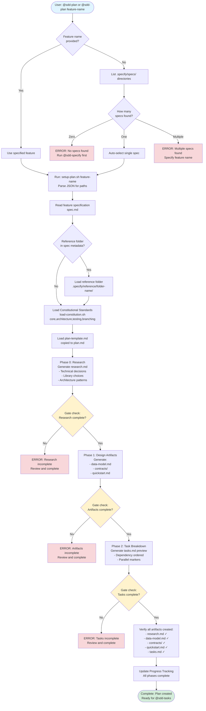

# @sdd-plan Flow Diagram

## Key Decision Points

1. **Feature Selection**: Auto-detect if only one spec exists
2. **Reference Context**: Automatically loaded if specified in spec.md
3. **Gate Checks**: Each phase must complete before proceeding
4. **Artifact Verification**: All required files must be generated

## Phase Breakdown

### Phase 0: Research

- Technical decisions and trade-offs
- Library and framework choices
- Architecture patterns to follow

### Phase 1: Design Artifacts

- **data-model.md**: Entities, relationships, validation
- **contracts/**: API endpoints, request/response formats
- **quickstart.md**: Integration test scenarios

### Phase 2: Task Breakdown

- Dependency-ordered task list
- Parallel execution markers
- TDD approach (tests before implementation)

## Output Files

- `.specify/specs/feature-name/plan.md` - Implementation plan
- `.specify/specs/feature-name/research.md` - Technical research
- `.specify/specs/feature-name/data-model.md` - Data models
- `.specify/specs/feature-name/contracts/` - API contracts
- `.specify/specs/feature-name/quickstart.md` - Test scenarios

## Next Step

Run `@sdd-tasks` to generate detailed task list
