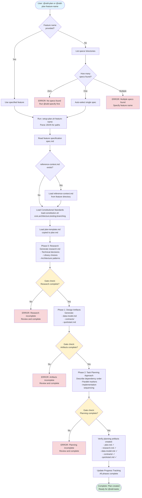

# @sdd-plan Flow Diagram

```mermaid
flowchart TD
    Start([User: @sdd-plan or @sdd-plan feature-name]) --> CheckFeature{Feature name<br/>provided?}

    CheckFeature -->|Yes| UseProvided[Use specified feature]
    CheckFeature -->|No| ListSpecs[List specs/ directories]

    ListSpecs --> CountSpecs{How many<br/>specs found?}

    CountSpecs -->|Zero| ErrorNoSpecs[ERROR: No specs found<br/>Run @sdd-specify first]
    CountSpecs -->|One| AutoSelect[Auto-select single spec]
    CountSpecs -->|Multiple| ErrorMultiple[ERROR: Multiple specs found<br/>Specify feature name]

    UseProvided --> RunSetup[Run: setup-plan.sh feature-name<br/>Parse JSON for paths]
    AutoSelect --> RunSetup

    RunSetup --> ReadSpec[Read feature specification<br/>spec.md]

    ReadSpec --> CheckRefFile{reference-context.md<br/>exists?}

    CheckRefFile -->|Yes| LoadRefContext[Load reference-context.md<br/>from feature directory]
    CheckRefFile -->|No| LoadConstitution

    LoadRefContext --> LoadConstitution[Load Constitutional Standards<br/>load-constitution.sh<br/>core,architecture,testing,branching]

    LoadConstitution --> LoadTemplate[Load plan-template.md<br/>copied to plan.md]

    LoadTemplate --> ExecutePhase0[Phase 0: Research<br/>Generate research.md<br/>- Technical decisions<br/>- Library choices<br/>- Architecture patterns]

    ExecutePhase0 --> GateCheck0{Gate check:<br/>Research complete?}

    GateCheck0 -->|No| ErrorGate0[ERROR: Research incomplete<br/>Review and complete]
    GateCheck0 -->|Yes| ExecutePhase1[Phase 1: Design Artifacts<br/>Generate:<br/>- data-model.md<br/>- contracts/<br/>- quickstart.md]

    ExecutePhase1 --> GateCheck1{Gate check:<br/>Artifacts complete?}

    GateCheck1 -->|No| ErrorGate1[ERROR: Artifacts incomplete<br/>Review and complete]
    GateCheck1 -->|Yes| ExecutePhase2[Phase 2: Task Planning Approach<br/>Describe dependency order<br/>- Parallel markers<br/>- Implementation sequencing]

    ExecutePhase2 --> GateCheck2{Gate check:<br/>Planning complete?}

    GateCheck2 -->|No| ErrorGate2[ERROR: Planning incomplete<br/>Review and complete]
    GateCheck2 -->|Yes| VerifyArtifacts[Verify planning artifacts created:<br/>- plan.md ✓<br/>- research.md ✓<br/>- data-model.md ✓<br/>- contracts/ ✓<br/>- quickstart.md ✓]

    VerifyArtifacts --> UpdateProgress[Update Progress Tracking<br/>All phases complete]

    UpdateProgress --> Done([Complete: Plan created<br/>Ready for @sdd-tasks])

    style Start fill:#e1f5ff
    style Done fill:#d4edda
    style ErrorNoSpecs fill:#f8d7da
    style ErrorMultiple fill:#f8d7da
    style ErrorGate0 fill:#f8d7da
    style ErrorGate1 fill:#f8d7da
    style ErrorGate2 fill:#f8d7da
    style GateCheck0 fill:#fff3cd
    style GateCheck1 fill:#fff3cd
    style GateCheck2 fill:#fff3cd
```

## Key Decision Points

1. **Feature Selection**: Auto-detect if only one spec exists
2. **Reference Context**: `reference-context.md` is loaded from the feature directory when present
3. **Gate Checks**: Each phase must complete before proceeding
4. **Artifact Verification**: All required planning artifacts must be generated before `@sdd-tasks`

## Phase Breakdown

### Phase 0: Research

- Technical decisions and trade-offs
- Library and framework choices
- Architecture patterns to follow

### Phase 1: Design Artifacts

- **data-model.md**: Entities, relationships, validation
- **contracts/**: Contract or interface definitions
- **quickstart.md**: Integration test scenarios

### Phase 2: Task Planning Approach

- Dependency ordering strategy
- Parallel execution rules
- TDD-oriented implementation sequencing

## Output Files

- `specs/feature-name/plan.md` - Implementation plan
- `specs/feature-name/research.md` - Technical research
- `specs/feature-name/data-model.md` - Data models
- `specs/feature-name/contracts/` - Contracts or interface definitions
- `specs/feature-name/quickstart.md` - Test scenarios

## Next Step

Run `@sdd-tasks` to generate detailed task list
