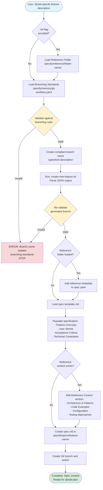

# @sdd-specify Flow Diagram



## Key Decision Points

1. **Reference Folder**: Optional context for enhanced specifications using `-ref <folder-name>`
2. **Branch Validation**: Critical checkpoint - must comply with standards
3. **Post-Script Validation**: Ensures generated branch name still complies
4. **Reference Context**: Stored in spec for reuse by @sdd-plan and @sdd-tasks

## Command Usage

```bash
# Basic specification creation
@sdd-specify "Add user authentication system"

# With reference context
@sdd-specify "Add user authentication system" -ref auth-patterns
```

## Output Files

- `.specify/specs/feature-name/spec.md` - Feature specification
- Git branch created: `type/feature-description`

## Next Step

Run `@sdd-plan` to create implementation plan
