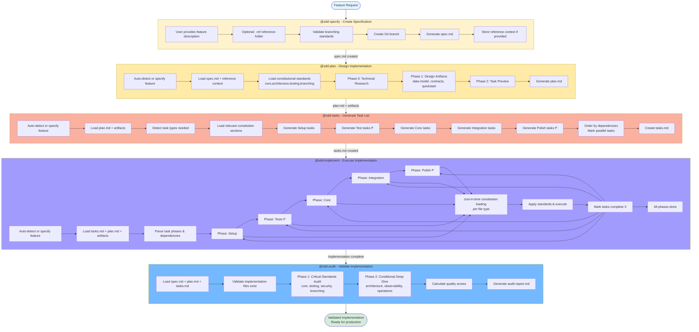

# SDD Workflow Overview

Complete flow diagram showing how the core development prompts work together in the Specification Driven Development workflow.



## Workflow Stages

### 1. @sdd-specify - Create Specification

**Input**: Natural language feature description  
**Output**: `spec.md` with structured requirements  
**Key Features**:

- Validates against branching standards
- Creates Git branch automatically
- Optional reference context for enhanced specs
- Stores reference metadata for downstream use

**Files Created**:

- `.specify/specs/feature-name/spec.md`

---

### 2. @sdd-plan - Design Implementation

**Input**: Feature specification  
**Output**: Complete implementation plan with design artifacts  
**Key Features**:

- Loads reference context from spec automatically
- Phase-based execution with gate checks
- Generates technical research and design docs
- Creates API contracts and test scenarios

**Files Created**:

- `.specify/specs/feature-name/plan.md`
- `.specify/specs/feature-name/research.md`
- `.specify/specs/feature-name/data-model.md`
- `.specify/specs/feature-name/contracts/`
- `.specify/specs/feature-name/quickstart.md`

---

### 3. @sdd-tasks - Generate Task List

**Input**: Implementation plan + design artifacts  
**Output**: Dependency-ordered, executable task list  
**Key Features**:

- Context-aware constitutional loading
- Parallel task detection [P]
- TDD approach (tests before implementation)
- Dependency ordering across phases

**Files Created**:

- `.specify/specs/feature-name/tasks.md`

**Task Phases**:

1. **Setup** - Project initialization
2. **Tests [P]** - Contract & integration tests (parallel)
3. **Core** - Models, services, endpoints
4. **Integration** - Database, middleware, logging
5. **Polish [P]** - Unit tests, performance, docs (parallel)

---

### 4. @sdd-implement - Execute Implementation

**Input**: Task list + all design artifacts  
**Output**: Working implementation with all tasks completed  
**Key Features**:

- Phase-by-phase execution
- Just-in-time constitutional loading per file type
- Parallel task execution where possible
- Automatic task completion tracking [X]

**Constitutional Loading Strategy**:

- **Test files** → `testing,branching`
- **Services** → `core,architecture,observability,branching`
- **Auth/Security** → `core,security,branching`
- **Database** → `core,architecture,branching`
- **API/Routes** → `core,architecture,security,branching`
- **Config** → `operations,security,branching`
- **Logging** → `observability,branching`

---

### 5. @sdd-audit - Validate Implementation

**Input**: Complete feature implementation (spec.md + plan.md + tasks.md + code)  
**Output**: Quality audit report with compliance scores  
**Key Features**:

- Two-phase progressive audit strategy
- Requirements coverage validation
- Constitutional compliance checking
- Prioritized issue reporting with severity levels

**Audit Phases**:

1. **Phase 1 - Critical Standards** → `core,testing,security,branching`
2. **Phase 2 - Conditional Deep Dive** → `architecture,observability,operations` (if issues detected)

**Files Created**:

- `.specify/specs/feature-name/audit-report.md`

---

## Key Principles

### Reference Context Flow

1. **@sdd-specify**: Load reference folder once, store in spec.md
2. **@sdd-plan**: Read reference context from spec.md metadata
3. **@sdd-tasks**: Read reference context from spec.md metadata
4. **Benefit**: Reference files loaded once, reused 3x (67% reduction)

### Constitutional Loading Strategy

- **@sdd-specify**: `branching` (validation only)
- **@sdd-plan**: `core,architecture,testing,branching` (planning essentials)
- **@sdd-tasks**: Context-aware based on task types
- **@sdd-implement**: Just-in-time based on file type being implemented

### Parallel Execution

- **Tests [P]**: Can run simultaneously (different endpoints/scenarios)
- **Core**: Parallel if different files, sequential if same file
- **Polish [P]**: Can run simultaneously (unit tests, docs, perf)

### TDD Approach

Tests are generated and executed before their corresponding implementation:

1. Contract tests → Then endpoints
2. Integration tests → Then services
3. Unit tests → Then utilities

---

## Verification Points

Each stage has validation:

- **@sdd-specify**: Branching standards compliance
- **@sdd-plan**: Gate checks after each phase
- **@sdd-tasks**: Dependency order verification
- **@sdd-implement**: Task completion tracking

---

## Next Steps After Implementation

After `@sdd-implement` completes:

1. **@sdd-audit feature-name** - Validate implementation against spec
2. Code review and testing
3. Merge to main branch
4. Deploy to production

---

## File Structure Overview

```
.specify/
├── memory/
│   ├── constitution/            # Project-specific constitution files
│   │   ├── core.md             # Filled-in from core-template.md
│   │   ├── architecture.md     # Filled-in from architecture-template.md
│   │   ├── testing.md          # Filled-in from testing-template.md
│   │   ├── security.md         # Filled-in from security-template.md
│   │   ├── observability.md    # Filled-in from observability-template.md
│   │   └── user-interface.md   # Filled-in from user-interface-template.md (optional)
│   └── git-workflow.yaml        # Branch naming rules
├── reference/
│   └── <folder-name>/           # Optional reference context
├── specs/
│   └── <feature-name>/          # Feature workspace
│       ├── spec.md              # ← @sdd-specify creates this
│       ├── plan.md              # ← @sdd-plan creates this
│       ├── research.md          # ← @sdd-plan creates this
│       ├── data-model.md        # ← @sdd-plan creates this
│       ├── contracts/           # ← @sdd-plan creates this
│       ├── quickstart.md        # ← @sdd-plan creates this
│       └── tasks.md             # ← @sdd-tasks creates this
└── templates/
    ├── constitution/            # Pristine template files (never modified)
    │   ├── core-template.md             # Technology stack template
    │   ├── architecture-template.md     # Service patterns template
    │   ├── testing-template.md          # Test strategy template
    │   ├── security-template.md         # Security policies template
    │   ├── observability-template.md    # Logging standards template
    │   └── user-interface-template.md   # Project-specific template (optional)
    ├── spec-template.md
    ├── plan-template.md
    └── tasks-template.md
```

---

## Command Summary

```bash
# 1. Create specification
@sdd-specify "Add user authentication system"
@sdd-specify "Add user authentication system" -ref auth-patterns

# 2. Create implementation plan
@sdd-plan                    # Auto-detect feature
@sdd-plan user-auth          # Specify feature

# 3. Generate task list
@sdd-tasks                   # Auto-detect feature
@sdd-tasks user-auth         # Specify feature

# 4. Execute implementation
@sdd-implement               # Auto-detect feature
@sdd-implement user-auth     # Specify feature

# 5. Validate implementation
@sdd-audit                   # Auto-detect feature
@sdd-audit user-auth         # Specify feature
```

---

**Total Time Estimate**:

- @sdd-specify: 2-5 minutes
- @sdd-plan: 10-20 minutes
- @sdd-tasks: 5-10 minutes
- @sdd-implement: 30-120 minutes (depends on complexity)
- @sdd-audit: 5-15 minutes

**Total Files Created**: 8+ files per feature

---

## Additional Utility Prompts

Beyond the core development workflow, additional prompts support project management and quality:

### @sdd-init

- Create or update project constitution with semantic versioning
- Validate consistency across templates
- Generate sync impact reports

### @sdd-drift

- Detect constitutional drift across entire project
- Identify security, coding, architecture, testing, and operations gaps
- Generate prioritized remediation plans

**Usage**:

```bash
# Create project constitution
@sdd-init

# Check project-wide compliance
@sdd-drift
```
